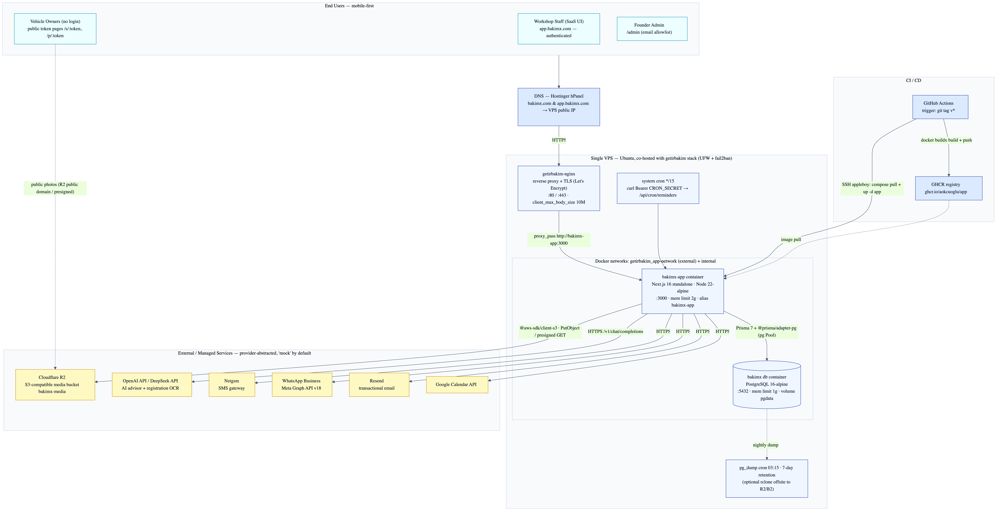
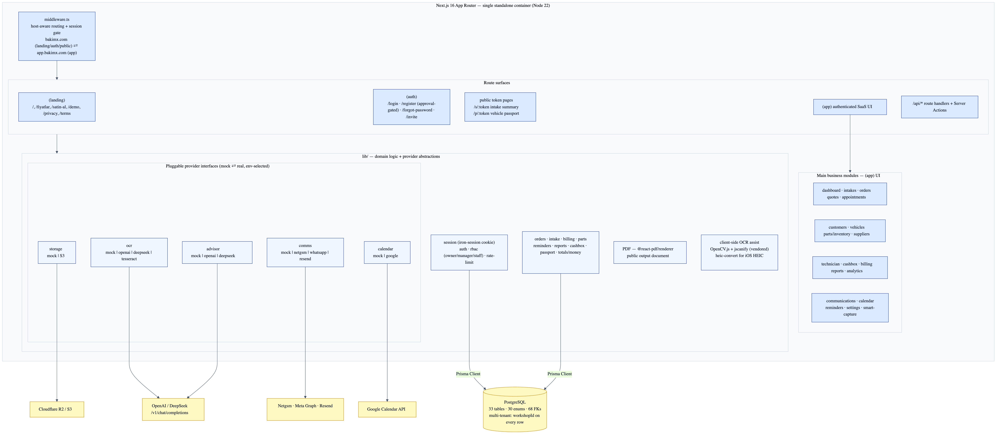

# BakımX — Technical Architecture & Tech Stack

> **Purpose of this document.** Prepared for AWS infrastructure planning. It describes the
> **current, as-built (implementation-aligned)** architecture of BakımX — not a target/aspirational
> design. Diagrams are provided in Mermaid source plus high-resolution SVG/PNG renders in this
> folder. An AWS-equivalent mapping is included in the appendix as a migration starting point.
>
> | | |
> |---|---|
> | **Product** | BakımX — multi-tenant SaaS for auto-repair workshops (intake, work orders, photo/damage checklist, billing, customer comms) |
> | **App version** | 0.5.12 |
> | **Primary usage** | Mobile-first web (workshop staff on phones/tablets) |
> | **Hosting today** | Single self-managed VPS, co-hosted with a sibling project (`getirbakim`) |
> | **Repository** | Next.js monorepo (single app), deployed as one Docker image |
> | **Document files** | `bakimx-infrastructure.{mmd,svg,png}`, `bakimx-modules.{mmd,svg,png}` |

---

## 1. Executive summary

BakımX is a **single Next.js 16 application** (App Router, React 19, TypeScript) packaged as one
**standalone Docker image** and run on a **single VPS** behind an Nginx reverse proxy that is
**owned and operated by a co-hosted sibling stack (`getirbakim`)**. State lives in a
**self-hosted PostgreSQL 16 container**; uploaded media (vehicle/registration photos) lives in
**Cloudflare R2** (S3-compatible object storage). All other third-party integrations
(AI advisor, OCR, SMS, WhatsApp, e-mail, calendar) are behind a **pluggable provider abstraction**
that defaults to in-process **`mock`** implementations, so the product runs end-to-end with **zero
external dependencies** and real providers are enabled per environment via environment variables.

The whole runtime is **one container + one database container**. There is currently **no managed
load balancer, no autoscaling, no managed database, no CDN in front of the app, and no Redis**.
These are the natural candidates for the AWS build-out (see §12).

---

## 2. Tech stack

### Application / runtime
| Layer | Technology | Version |
|---|---|---|
| Language | TypeScript (strict) | 5.x |
| Framework | Next.js (App Router, `output: standalone`, Server Components + Server Actions + Route Handlers) | 16.2.6 |
| UI runtime | React / React DOM | 19.2.4 |
| Node runtime (container) | Node.js (Alpine) | 22 |
| Package manager / script runner | Bun (+ `tsx` for TS scripts) | — |

### UI / frontend
| Concern | Technology |
|---|---|
| Styling | Tailwind CSS v4 (`@tailwindcss/postcss`), `tw-animate-css` |
| Components | shadcn, Base UI (`@base-ui/react`), `class-variance-authority`, `tailwind-merge`, `clsx` |
| Icons / animation | `lucide-react`, `framer-motion` |
| Forms / validation | `react-hook-form` + `@hookform/resolvers` + **Zod 4** (shared server/client validation) |
| Misc UI | `next-themes`, `sonner` (toasts), `qrcode.react` |

### Data / backend
| Concern | Technology |
|---|---|
| ORM | Prisma 7.8 with the **driver adapter** `@prisma/adapter-pg` over `pg` (node-postgres) connection **Pool** |
| Database | PostgreSQL 16 (prod container) / 17 (local) |
| Auth / sessions | `iron-session` 8 (stateless, encrypted cookie) + `bcryptjs` password hashing |
| IDs / tokens | `cuid` (primary keys), `nanoid` (public tokens) |
| Object storage SDK | `@aws-sdk/client-s3` v3 + `@aws-sdk/s3-request-presigner` |
| PDF generation | `@react-pdf/renderer` (server-rendered customer output) |
| Image handling | `sharp` + `heic-convert` (iOS HEIC → web), client-side **OpenCV.js + jscanify** (vendored) for live registration-document scanning |
| OCR | `tesseract.js` (optional local OCR) + remote vision OCR (OpenAI / DeepSeek) |

### Infrastructure / delivery
| Concern | Technology |
|---|---|
| Containerization | Docker (multi-stage build, non-root runtime user) |
| Orchestration | Docker Compose (single host) |
| Reverse proxy / TLS | Nginx + Let's Encrypt (**owned by the co-hosted `getirbakim` stack**) |
| Registry | GitHub Container Registry — `ghcr.io/aokcuoglu/app` |
| CI/CD | GitHub Actions (build on `v*` tag → push to GHCR → SSH deploy to VPS) |
| Object storage | Cloudflare R2 (S3-compatible); MinIO for local dev |
| DNS | Hostinger hPanel (A records → VPS public IP) |

> **Notable build detail:** Next.js is pinned and **patched** (`patches/next@16.2.6.patch`) to bound a
> React dev-mode async-debug `Map` that otherwise grows unbounded ("Map maximum size exceeded"). This
> only affects dev mode but is committed for reproducibility.

---

## 3. High-level infrastructure & component layout

> Source: [`bakimx-infrastructure.mmd`](./bakimx-infrastructure.mmd) · Vector: [`bakimx-infrastructure.svg`](./bakimx-infrastructure.svg)

### Deployment topology (current)
- **One VPS** (Ubuntu) hosts **two independent stacks**: `getirbakim` and `bakimx`.
- **Nginx + TLS are owned by `getirbakim`.** Its Nginx terminates 80/443, holds the Let's Encrypt
  certificates, and reverse-proxies `app.bakimx.com` to the BakımX container via a **shared external
  Docker network** (`getirbakim_app-network`). BakımX joins that network as `external` and exposes a
  stable alias **`bakimx-app:3000`** so the proxy target never collides with other stacks. **There is
  no Caddy and no separate BakımX load balancer.**
- **Two containers for BakımX:**
  - `bakimx-app` — Next.js standalone server, `:3000`, **memory-limited to 2 GB** (headroom for
    `sharp`/`heic-convert` image processing on photo uploads).
  - `db` — PostgreSQL 16-alpine, `:5432`, **memory-limited to 1 GB**, data on a named volume `pgdata`.
- **Startup ordering coupling:** `getirbakim` owns the shared network, so it must be up before BakımX
  starts, otherwise BakımX fails with "network not found". (A known fragility — see §12.)

### Two subdomains, one container (host-aware routing)
`middleware.ts` serves both hosts from the **same container** by inspecting the `Host` header:
- `bakimx.com` → marketing/landing, auth (`/login`, `/register`, `/forgot-password`), public
  customer token pages (`/s/:token`, `/p/:token`), and `/api/*`.
- `app.bakimx.com` → the authenticated SaaS app at **clean URLs** (no `/app` prefix).
- The **session cookie is scoped to `.bakimx.com`** so login on the landing host carries into the app
  host. Local dev collapses to a single host with path-based auth.

### Networking / security at the edge
- UFW + fail2ban on the host; Nginx `client_max_body_size 10M` for photo uploads.
- TLS via Let's Encrypt (managed by the `getirbakim` Nginx).
- `www.bakimx.com` → 301 to apex; legacy `/app/*` → 301 to clean app-host URLs.

---

## 4. Implementation-aligned module view

> Source: [`bakimx-modules.mmd`](./bakimx-modules.mmd) · Vector: [`bakimx-modules.svg`](./bakimx-modules.svg)

The app is a layered monolith inside one container:

1. **`middleware.ts`** — host-aware routing + auth gate (the only request-level cross-cut).
2. **Route surfaces** (App Router route groups):
   - `(landing)` — public marketing pages, pricing, demo/purchase request.
   - `(auth)` — login, **approval-gated** registration, forgot-password, team invite acceptance.
   - **public token pages** — `/s/:token` (intake/service summary for the customer) and
     `/p/:token` (vehicle "service passport"); no login, scoped by an unguessable `nanoid` token.
   - `(app)` — the authenticated SaaS UI (see §5).
   - `/api/*` — Route Handlers, complemented by **Server Actions** for mutations.
3. **`lib/`** — domain logic + **pluggable provider interfaces**. Each external capability is an
   interface with a `mock` implementation and one or more real implementations, selected at runtime by
   an env var. This is the core extensibility pattern of the codebase (see §7–§9).
4. **Persistence** — Prisma Client (pg adapter) → PostgreSQL.

---

## 5. Main application modules

Authenticated `(app)` surface (each is a feature area with its own routes, server actions, and
`lib/` logic):

| Module | Responsibility |
|---|---|
| **dashboard** | KPIs / daily operational overview |
| **intakes** | Vehicle intake wizard (customer + vehicle + complaint + photos + damage marks) |
| **orders** | Work orders (service orders): items, labor, parts, status lifecycle, payment status |
| **quotes** | Estimates that convert into work orders |
| **appointments** | Scheduling, reminders, conversion to work orders |
| **customers / vehicles** | CRM: individual & corporate customers, their vehicles (plate/VIN), consents (KVKK) |
| **parts / inventory** | Stock items, stock movements, critical-stock thresholds |
| **suppliers** | Supplier directory + parts sourcing |
| **technician** | Technician roster, assignment, labor sessions, checklists, internal notes, parts requests |
| **cashbox / cash** | Collections / payments against work orders |
| **billing** | Subscription plan tier, manual/`havale` (bank-transfer) purchase wizard, admin activation, receipts |
| **reports / analytics** | Operational and financial reporting |
| **communications** | SMS/WhatsApp/e-mail templates, scheduler, triggers, delivery logs |
| **calendar** | Appointment/delivery/reminder calendar + optional Google Calendar sync |
| **reminders** | Maintenance reminders (date/mileage based) + cron-driven dispatch |
| **smart-capture** | Registration-document (ruhsat) scan → OCR → confirm flow |
| **settings / workshop** | Workshop profile, branding, working hours, provider keys |
| **/admin** | Founder console (email-allowlist gated) for tenant approval & billing |

**Data model:** 33 tables, 30 enums, 68 foreign keys. Everything is tenant-scoped — almost every
table carries a `workshopId` and is indexed on it.

---

## 6. Storage layers

| Storage layer | Technology | What it holds |
|---|---|---|
| **Relational (system of record)** | PostgreSQL 16 (self-hosted container, `pgdata` volume) | All business data — workshops, users, customers, vehicles, intakes, orders, billing, logs, etc. |
| **Object storage (media)** | Cloudflare R2 (S3-compatible) — bucket `bakimx-media`; **MinIO** locally | Vehicle photos, registration-document scans, logos, PDF assets |
| **Session state** | None server-side — encrypted **stateless cookie** (`iron-session`) | Auth session (`userId`, `workshopId`) |
| **Rate-limit / ephemeral** | **In-process `Map`** (per-container, fixed-window) | Login/abuse throttling — **not shared across instances** |

**Object-storage access pattern** (`src/lib/storage/`): a `StorageProvider` interface with `mock`
(in-memory) and `S3` implementations. The S3 provider uses AWS SDK v3 with `forcePathStyle` and
`endpoint`/`region` from env, so the **same code targets MinIO (local), Cloudflare R2 (prod), or AWS
S3** by changing env vars only. Public customer photos are served either from a configured public
domain (`S3_PUBLIC_DOMAIN`) or via **presigned GET URLs** (default 1-hour expiry). Uploads are
validated for MIME type and max size; iOS HEIC is converted with `heic-convert`.

**Backups:** nightly `pg_dump --clean` at 03:15, gzipped, 7-day retention on the VPS disk. Offsite copy
(rclone → R2/B2) is wired but **optional/unset** — a current durability gap. R2 object versioning is
recommended for media recovery.

---

## 7. Database connectivity

- **Driver:** Prisma 7 via the **`@prisma/adapter-pg` driver adapter** over a `pg` (node-postgres)
  **connection Pool**, created once per process (singleton in `src/lib/db.ts`) and reused across
  requests. There is no PgBouncer in the current container setup.
- **Connection strings:** `DATABASE_URL` (pooled/app) and `DIRECT_URL` (migrations / DDL). In prod
  both point at the in-network `db:5432` container; the example config also documents a Supabase
  pooler URL as an alternative (`pgbouncer=true` on 6543, direct on 5432).
- **Migrations:** Prisma Migrate with a **squashed `0_init` baseline** that creates the full schema
  from empty. **Migrations do NOT run automatically** on deploy — they are applied manually/by script
  (`prisma migrate deploy`) **after** the new image is live, with a backup taken first. `db push` is
  prohibited in production. (Full runbook: `DB.md`.)
- **Multi-tenancy:** enforced in application code — `workshopId` is derived from the authenticated
  session (never trusted from a client parameter) and applied to every query; tables are indexed on
  `workshopId`.

---

## 8. AI provider integrations

Two distinct AI-backed capabilities, both behind provider interfaces, both **`mock` by default**:

### a) AI Service Advisor (`src/lib/advisor/`)
- **Purpose:** given a customer complaint + vehicle + prior work orders, suggest inspections, labor,
  parts, a customer-facing description, and an internal note (Turkish, strict JSON output).
- **Providers:** `mock` | `openai` | `deepseek`.
- **Endpoints called:** `https://api.openai.com/v1/chat/completions` and
  `https://api.deepseek.com/v1/chat/completions` (OpenAI-compatible chat-completions, `temperature 0.3`,
  `max_tokens 1500`).
- **Models (configurable):** `gpt-4o-mini` (OpenAI default), `deepseek-chat` (DeepSeek default);
  overridable via `AI_MODEL`.
- **Gating:** the advisor is a **Premium-tier** feature (403 + UI upsell for lower tiers).

### b) Registration-document OCR (`src/lib/ocr/`)
- **Purpose:** read the vehicle registration (ruhsat) to auto-fill plate/brand/VIN/owner, then the
  user confirms before save. Every run is recorded in an `OcrLog` (raw text never exposed publicly).
- **Providers:** `mock` | `openai` | `deepseek` | `tesseract`.
  - `openai`/`deepseek` — remote vision/text models (`gpt-4o` / `deepseek-chat` defaults, via
    `OCR_MODEL`).
  - `tesseract` — fully local OCR (`tesseract.js`), no API key, lower accuracy (fallback).
- **Client-side assist:** the live camera scanner runs **OpenCV.js + jscanify in the browser**
  (vendored, self-hosted — deliberately **not** an npm dependency so `canvas`/`jsdom` never reach the
  Alpine production image) for document edge-detection/normalization before OCR.

> **Important for AWS planning:** there is **no Anthropic/Bedrock integration today**; AI is optional
> and OpenAI/DeepSeek-based. If AI moves to AWS, **Amazon Bedrock** (LLM) and **Amazon Textract** (OCR)
> are the natural managed equivalents and would slot behind the existing provider interfaces with a
> new implementation class each.

---

## 9. Communication & calendar integrations

All behind provider interfaces in `src/lib/communications/` and `src/lib/calendar/`, **`mock` by
default**, with every send recorded in `CommunicationLog` / `CalendarSyncLog`:

| Capability | Real provider | Endpoint |
|---|---|---|
| SMS | **Netgsm** | `https://api.netgsm.com.tr/sms/send/get` |
| WhatsApp | **WhatsApp Business** (Meta) | `https://graph.facebook.com/v18.0` |
| E-mail | **Resend** | `https://api.resend.com/emails` |
| Calendar | **Google Calendar** | `https://www.googleapis.com/calendar/v3` |

**Scheduled jobs:** a single cron endpoint `POST /api/cron/reminders` (auth: `Bearer CRON_SECRET`,
returns 500 if the secret is unset, 401 on mismatch — never public) is invoked by an external
system cron (`*/15`) to dispatch due maintenance reminders.

---

## 10. Authentication, security & multi-tenancy

- **Sessions:** stateless **`iron-session`** encrypted cookie `bakimx_session` (HttpOnly, `Secure` in
  prod, `SameSite=Lax`, `domain=.bakimx.com`, 7-day max-age). `SESSION_SECRET` must be ≥32 chars or the
  app refuses to boot in production.
- **Passwords:** `bcryptjs` hashes.
- **RBAC:** workshop-scoped roles `owner` / `manager` / `staff`; seats can be soft-disabled.
- **Tenant isolation:** `workshopId` always derived from the session, never from client input; applied
  to every data query (core security invariant of the codebase).
- **Customer approval:** OTP-based `ApprovalRequest` flow for public intake approval; public share
  links and vehicle passports are unguessable `nanoid` tokens with per-link visibility flags and
  optional expiry.
- **Team invites:** raw invite token only in the e-mailed URL; only `sha256(token)` is stored.
- **Onboarding gate:** self-serve registration creates a workshop in **`pending`** status — no access
  until an admin approves (deliberate, not a public instant-provisioning flow).
- **Rate limiting:** in-process fixed-window limiter — **per-container only**; must move to a shared
  store (Redis) before horizontal scaling.
- **Admin console:** `/admin` is gated by an `ADMIN_EMAILS` allowlist (404 for everyone if unset).

---

## 11. CI/CD & deployment pipeline

1. Developer pushes a **`v*` git tag** (or runs `workflow_dispatch`).
2. **GitHub Actions** builds the Docker image with Buildx (GHA layer cache) and pushes multi-tag
   (`semver`, `sha`, `latest`) to **GHCR** (`ghcr.io/aokcuoglu/app`).
3. The deploy job **SSHes into the VPS** (`appleboy/ssh-action`) and runs
   `docker compose pull app && docker compose up -d app --force-recreate`, then **prunes dangling
   images only** (never a full `system prune` — it would delete the co-hosted `getirbakim` stack's
   images/networks).
4. **Database migrations are applied manually/by script afterward** (`scripts/db-migrate-prod.sh` →
   backup + `prisma migrate deploy`). They are intentionally **not** part of the automated deploy.

> A staging environment + an automated migration gate are in flight (release-pipeline work) but the
> live pipeline today is the single-VPS, tag-triggered flow above.

---

## 12. Current server specs, constraints & scaling notes

### Server / machine profile (as-built)
- **Single VPS**, Ubuntu, **shared** between `getirbakim` and `bakimx` (plus the shared Nginx and, for
  `getirbakim`, Meilisearch). Repo guidance recommends **≥ 4 vCPU / ≥ 8 GB RAM** for the combined
  footprint. *(Exact instance size is operator-configured and not pinned in the repo — confirm with
  the VPS provider.)*
- **BakımX resource caps:** app container **2 GB**, database container **1 GB** (Compose `mem_limit`).
- **Single instance of everything** — one app container, one Postgres container, one node. No
  redundancy, no autoscaling.

### Known constraints / single points of failure (relevant to an AWS build-out)
- **Shared-network coupling:** BakımX's reverse proxy, TLS, and Docker network are owned by a
  *different* project. If `getirbakim` goes down or recreates the network, BakımX is affected.
- **No managed LB / TLS of its own**, **no CDN** in front of the app.
- **Self-hosted single-node Postgres** with local-disk backups (offsite copy optional/unset) — no HA,
  no PITR, no read replicas.
- **In-process rate limiting and no shared cache** — blocks horizontal scaling (>1 app instance) until
  moved to Redis/Postgres.
- **Manual, decoupled DB migrations** — deploy and schema change are separate human steps.

---

## Appendix A — AWS-equivalent mapping (migration starting point)

> Indicative only — the existing **provider abstraction** means storage and AI/comms can be re-pointed
> to AWS by swapping env vars / adding one implementation class, with no business-logic changes.

| Current | AWS-managed equivalent | Notes |
|---|---|---|
| Next.js standalone container on VPS | **ECS Fargate** (or App Runner / EKS) behind **ALB** | App is already a 12-factor single image on `:3000`; horizontal scaling needs the Redis change below |
| `getirbakim`-owned Nginx + Let's Encrypt | **Application Load Balancer + ACM** (+ optional **CloudFront** CDN) | Removes the cross-project coupling and gives BakımX its own edge |
| PostgreSQL 16 container (`pgdata`) | **Amazon RDS for PostgreSQL** (or Aurora PostgreSQL) | Managed backups/PITR/HA/read replicas; keep Prisma `migrate deploy` flow |
| Cloudflare R2 (`bakimx-media`) | **Amazon S3** (+ CloudFront for public media) | Code already uses AWS SDK v3 S3 client — point `S3_ENDPOINT`/creds at S3 |
| In-process rate limit / no cache | **Amazon ElastiCache (Redis)** | Prerequisite for running >1 app instance |
| OpenAI / DeepSeek (advisor + OCR) | **Amazon Bedrock** (LLM) + **Amazon Textract** (OCR) | Optional; add new provider implementations behind existing interfaces |
| External system cron → `/api/cron/reminders` | **EventBridge Scheduler** → ALB/HTTPS (Bearer secret in **Secrets Manager**) | Keep the bearer-token contract |
| GitHub Actions → GHCR → SSH | **GitHub Actions → ECR → ECS deploy** (or CodePipeline/CodeBuild) | Replace SSH step with ECS service update |
| `.env.production` on disk | **AWS Secrets Manager / SSM Parameter Store** | `SESSION_SECRET`, `CRON_SECRET`, DB + provider keys |
| `pg_dump` cron, local disk | **RDS automated backups + snapshots** (cross-region optional) | Closes the offsite-durability gap |

---

*Generated from a full source review of the BakımX repository (app v0.5.12). Diagram sources and
high-resolution renders accompany this document in `docs/architecture/`.*
